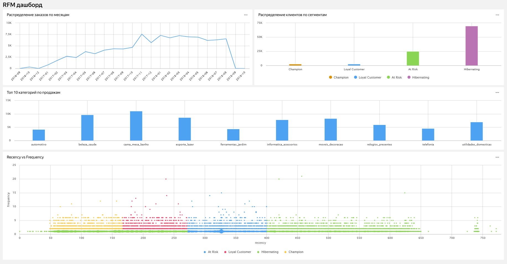

# 🛍️ Анализ поведения клиентов интернет-магазина и RFM-сегментация

## 📌 Описание проекта

В этом проекте я проанализировал поведение клиентов бразильского интернет-магазина на основе открытого датасета Olist. Цель — изучить динамику заказов, поведение клиентов, а также сегментировать базу по методу RFM. Визуализации представлены в виде интерактивного BI-дэшборда в Yandex DataLens.

---

## 🧰 Используемые технологии

- **Python** (pandas, matplotlib, sqlite3)
- **SQL** (SQLite)
- **BI**: Yandex DataLens
- **Jupyter Notebook**

---

## 🧩 Этапы работы

### 1. Подготовка данных
- Загрузка и объединение 8 таблиц из CSV-файлов
- Преобразование форматов дат и идентификаторов
- Обработка пропущенных значений
- Проверка на дубликаты

### 2. Исследовательский анализ (EDA)
- Распределение заказов по месяцам
- ТОП-10 товарных категорий
- География заказов

### 3. RFM-анализ клиентов
- Расчёт:
  - **Recency** — как давно был последний заказ
  - **Frequency** — сколько заказов было у клиента
  - **Monetary** — на какую сумму клиент заказал товаров
- Сегментирование клиентов по их профилям: Champion, Loyal, At Risk, Hibernating
- Визуализация Recency vs Frequency

### 4. BI-визуализация в Yandex DataLens
- 4 интерактивных графика: динамика заказов, RFM-сегменты, топ категорий и карта клиентов

---

## 📊 Интерактивный дашборд

---

## 💡 Ключевые выводы

- **70% клиентов** относятся к сегменту **Hibernating** — они давно не покупали, но при этом сгенерировали **9200401₽**, что делает их ключевой зоной для реактивации.
- **Сегмент At Risk** — 25% базы, их удержание может предотвратить потери в ~3.4 млн₽.
- **Только ~5% клиентов** (Champions + Loyal Customers) приносят **более 1 млн₽**, и заслуживают персонализированного подхода.
- Топ-3 категории: `cama_mesa_banho`, `beleza_saude`, `informatica_acessorios`.

---

## 📂 Источник данных

Датасет: [Brazilian E-Commerce Public Dataset by Olist (Kaggle)](https://www.kaggle.com/datasets/olistbr/brazilian-ecommerce)

---

## 📦 Что можно улучшить

- Расширить сегментацию с помощью кластеризации (KMeans)
- Добавить прогноз оттока (churn prediction)
- Перевести проект на PostgreSQL
- Реализовать автоматическую отчётность

---

## 👨‍💻 Автор проекта

**[Твоё имя]**  
Junior Data Analyst  
📫 Telegram / LinkedIn / Email (по желанию)

